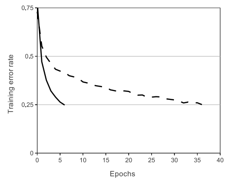
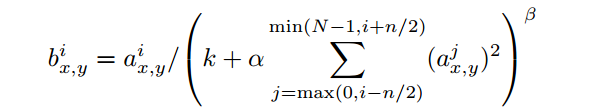
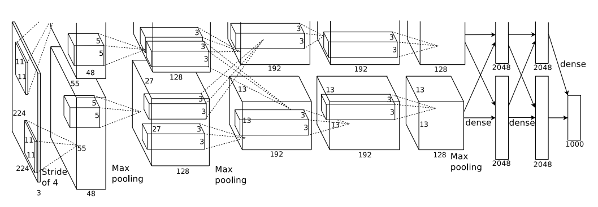
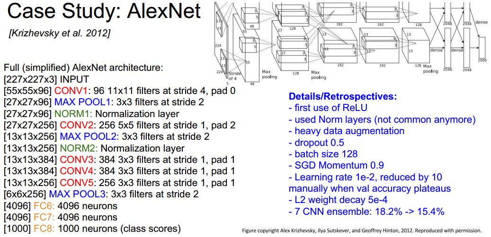
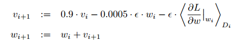
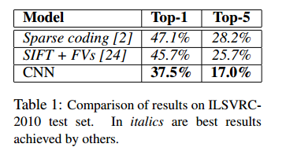
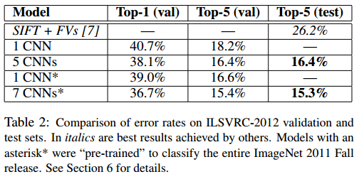
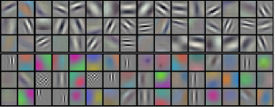
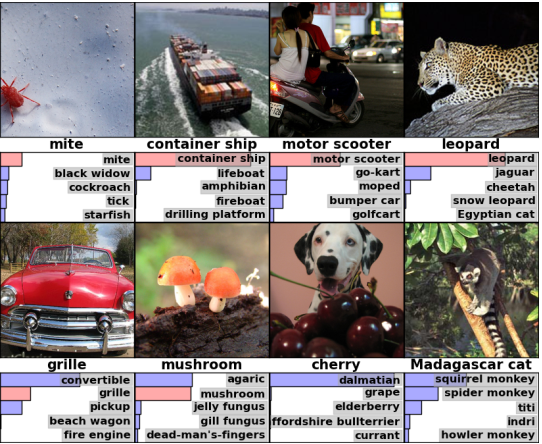
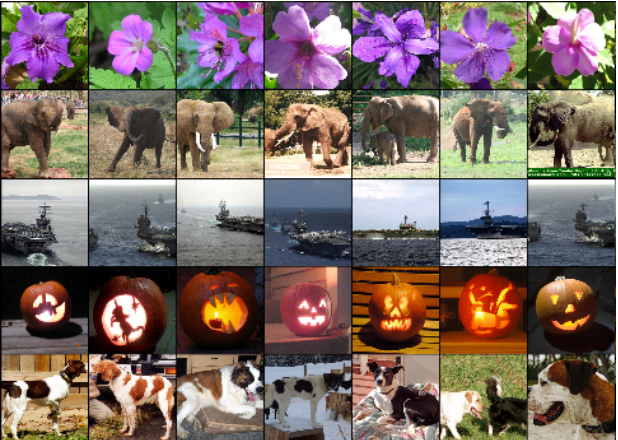

# Introduction

* 当前 `labeled images` 数据集相对较小

* CNN对于`nature images`可以做出 `strong and mostly correct assumption`

* CNN与标准的 `feedforward neural network`相比，少了很多 `connections and parameters`,因此更容易训练，并且理论上能达到的性能可能只是稍微差一点

* 具体贡献

  1. 基于ILSVRC-2010及ILSVRC-2012的ImageNet数据集，训练了目前最大的CNN，并且取得了目前为止对该数据集最好的分类结果

  2. 编写了一个高度优化的在GPU环境执行的二维卷积过程，以及其他训练CNN的相应操作

  3. 网络包含了一些新颖的特征，不仅提高了分类效果还减少了训练耗时

  4. 使用了几种有效的方法防止过拟合

  5. 最后训练出的网络包含五个卷积层和三个全连接层，这个深度设置非常关键：我们发现移除任何一个卷积层（虽然只包含不超过全局1%的参数）都会导致较差的分类效果

# The Dataset

本小节介绍了 `ImageNet` 数据集，在`ILSVRC-2010`和`ILSVRC-2012`中用到的数据集是 `ImageNet` 的子集。

# The Architecture

## ReLU

* 在一个四层的`CNN`上，使用`ReLU`达到的**0.25**的`Training rate`的速度比使用`tanh`的速度快**6倍**

* 在对比的过程中网络架构一致，但是学习率不同，目的是让训练过程尽可能快

* 没有添加正则项

## Training on Multiple GPUs

## Local Response Normalization

* `ReLU`有一个良好的性质:不需要对输入数据进行归一化以防止饱和，只要有一小部分训练样本产生对ReLU的正值输入，那么这个神经元就会工作，但是发现以下的局部响应归一化操作依然会**有助于泛化**

* 这种归一化操作用在网络的某些层的ReLU层之后
* 这类响应归一化其实是受到真实神经元侧抑制现象的启发在进行类似的操作
* 其效果就是使不同卷积核计算的神经元输出值之间**对计算值比较大的神经元活动(big activities)更为敏感**
* 在`CIFAR-10`数据集上证明这种归一化方式的有效性：没有LRN时，test error rate为13%，有LRN，test error rate为11%

## Overlapping Pooling

* 传统的池化过程用到的`kernel`在移动的过程中是不重合的，而本文使用` size = 3×3`，`strid = 2`的`kernel`进行池化，这种方式与` size = 3×3`，`strid = 3`的`kernel`相比，**top-1**和**top-5** 误差率分别减小了 **0.4%** 和 **0.3%**
* 在训练过程中发现，使用`overlapping pooling`的模型更不容易过拟合

## Overall Architecture

* 概述：前5个是卷积层，后面3个是全连接层。最后一个全连接层的输出结果提供给**1000-way softmax**
* 图中上下两部分分别搭载在两部不同的`GPU`上，只在卷积层的第3层和网络后部的全连接层才接收前一层所有的输出结果
* 前2个卷积层后连接有`Local Response Normalization`层
* 池化层位于**每一个Local Response Normalization层**之后以及**第五个卷积层**之后
* 每个卷积层和全连接层之后都跟有一个`ReLU`层

# Reducing Overfitting

## Data Augmentation

  * 方法一：图像平移和水平方向的翻转
  * 训练过程中，对256×256的图像随机裁剪224×224的图像，当一上个batch的图片在`GPU`进行训练时，通过 `Python` 代码在`CPU`上生成 transformed images，因此不占用GPU资源
      * 测试过程中，提取test image的5个224×224的图像patch(左上，右上，中，左下，右下)进行evaluate，再将softmax输出的结果求均值，这个操作也叫作multi crops
  *   方法二：能过`PCA`调整训练图像的RGB各颜色通道强度

    * 对像素RGB值分别进行主成分分析（PCA），然后将原本的图像加上1）主成分特征向量与2）特征值和3）一个随机量的乘积

    * 这一调整是为了突出自然图像的一个重要性质，就是对物体图像的识别不应该受到其表面**色彩的强度和颜色**的影响

    * 这一操作降低`top-1误差`超过1%

## DropOut

  * 结合多个不同模型的预测结果可以降低测试错误率，但是太费时，DropOut是一种十分有效的 `model combination`的方法

  * 在训练过程中将隐含层神经元的输出结果依 **p = 0.5** 概率设置为0， 在测试时，使用所有的神经元，将他们的输出结果乘以0.5，这其实是由极多的经过随机失活的神经网络产生的平均分类结果的一个合理近似值

  * 我们在前两个全连接层使用Dropout，否则，神经网络训练就会出现很严重的过拟合。但是有`Dropout`的存在使模型收敛所需的迭代次数翻倍

# Details of learning

* 参数设置：`batch_size = 128, momentum = 0.9, weight decay = 0.0005`,这个微小的`weight decay`对于模型的学习很重要，换句话说，这个decay不仅仅起到正则化的作用，还能**降低模型的训练误差**，weight的更新方法为：

* 其中` i `为迭代次数， `v` 为 `momentum`，`ε` 为学习率，括号项为第 `i` 个批量样本D_i（128个）上所有目标函数在`w_i`处对权重的偏导数的均值。

* 初始化：
  * 每层的权值服从0均值的高斯分布，标准差为 0.01

  * 第2,4,5层卷积层以及全连接的隐藏层中的偏置初始化为1(为了给ReLU提供正数的输入)，其余各层中的偏置初始化为0

  * 学习率初始化为0.01，在训练过程中，如果验证集的误差停止，手动将学习率缩小10倍

  * 对120万张图像训练了约90个周期，使用两块`NVIDIA GTX 580 3GB GPU`，总共花费5-6天

# Results

 

## Qualitative Evaluations

上图为第一个卷积层的输出，前48个和后48个运算分别在两个GPU上进行，GPU1上的卷积核基本上是不识别颜色的，而GPU2上的卷积核大部分是能识别颜色的。这样的分工效果在每一次训练中都会出现，而且与任一权重的随机初始化是不相关的

上图是我们模型对八幅测试图像计算的前五个分类，作为我们评估模型训练效果的定性分析基础。值得一提的是，部分不在图像中心的物体，比如左上角的小虫子都可以被模型准确辨识。大部分预测都是比较靠谱的。比如，对猎豹的前五个分类中，除了第一个正确分类外，其他分类结果都至少将其归类为猫科动物。不过有些情况下（比如汽车和樱桃），图像内容和真实标签的对应本身就有很大的歧义

上图展示了五张ILSVRC-2010测试图像以及分别计算出六张最为接近的训练集图像。可以观察到，在像素层面上，返回的几张训练图像其实与第一列的测试图像的L2距离不是特别接近。例如，第二行和第五行用大象和狗的测试图像返回的训练图像里姿势多种多样。

# Discussion

* 大型深度CNN可以在比较困难的数据集上单纯使用监督学习方法取得突破性进展

* 网络的深度对我们的模型特别重要，若移除我们模型中的任何一个卷积层，训练效果都会大打折扣

* 我们的最终目标是用非常大且深的神经网络对视频序列进行训练，因为视频文件的**时间结构**提供了很有用的信息，而这些信息是静态图片所不具备或表达的不明显的

# 笔记参考资料
[运用CNN对ImageNet进行图像分类](https://blog.csdn.net/LK274857347/article/details/53514364)
