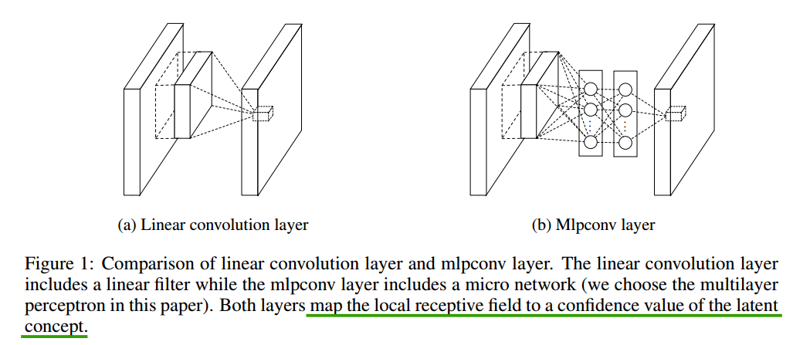
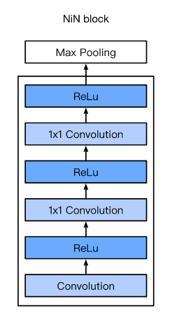
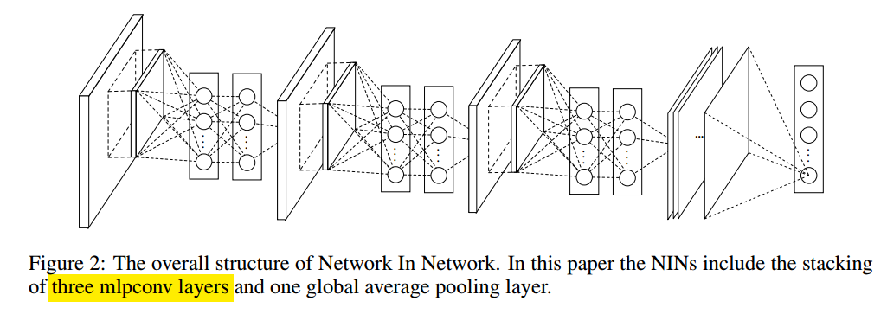
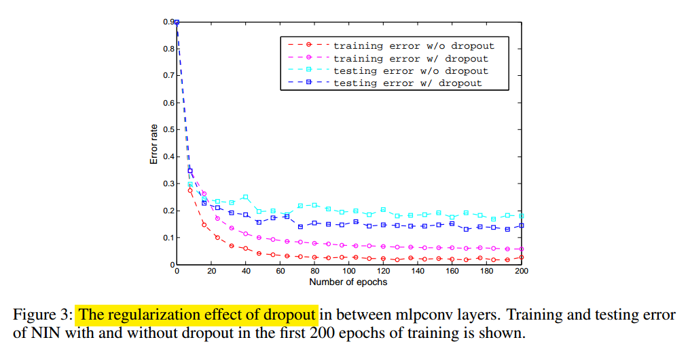

# 主要改进
## MLP-conv替代Linear convolution layer
NiN block：其实就是在两个常规的卷积核之间增加了两个**1×1**的卷积核

更直观一点的示意图

MLP在CNN基础上的进步在于:

* MLP实现了feature map跨通道的**非线性组合**(因为每个1×1卷积核后都紧跟着一个ReLU)，从而在相同的感受野范围能提取更强的非线性特征，提高特征抽象能力

## MLP-conv + Global Average Pooling替代全连接层
好处：
* feature maps可以理解为对分类的置信度

* Global Average Pooling没有需要优化的参数，因此可以大大减小模型的参数量，避免模型发生过拟合

* Global Average Pooling对空间信息进行了sum out，对于input的平移具有更强的鲁棒性

# 网络架构
**Three mlpconv layers followed by global average pooling**, NiN内部的层数以及NiN块的个数可以根据不同任务进行调整

## 关于Dropout的使用
论文的4.1小节明确的说明： **As a regularizer, dropout is applied on the outputs of all
but the last mlpconv layers**，即除了最后一个MLP-conv，所有的MLP-conv之间都是要加dropout的，这里有两个疑问：

* 网上大部分代码都只在最后一个MLP-conv之间加dropout

* 一般情况下，dropout加在全连接层内用于防止过拟合，但是为什么NiN的每两个MLP-conv之间都要有dropout呢？

思考：
* 关于第一个疑问，因为没有官方的开源代码，因此以论文为准；

* 对于第二个疑问，思考后认为每个MLP-conv中的1×1卷积核的作用其实和全连接层一样，都是对feature进行更高层次的抽象，所以每两个MLP-conv之间都要有dropout

网络中有无dropout的对比实验结果

# 参考
[CNN架构优化之一：Network in Network](https://zhuanlan.zhihu.com/p/31199400)

[NIN一个即使放到现在也不会过时的网络](https://zhuanlan.zhihu.com/p/337035992)

[卷积神经网络之-NiN 网络](https://zhuanlan.zhihu.com/p/100970567)

[Network_in_Network code](https://github.com/vipul2001/Modern-CNNs-Implementation/tree/master/Network_in_Network)
