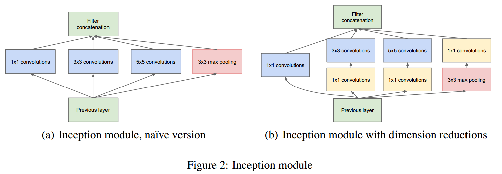
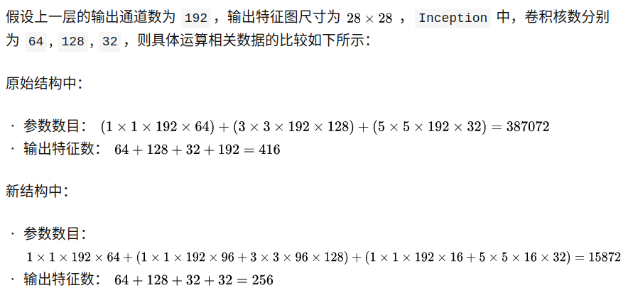
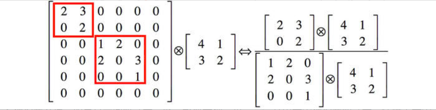
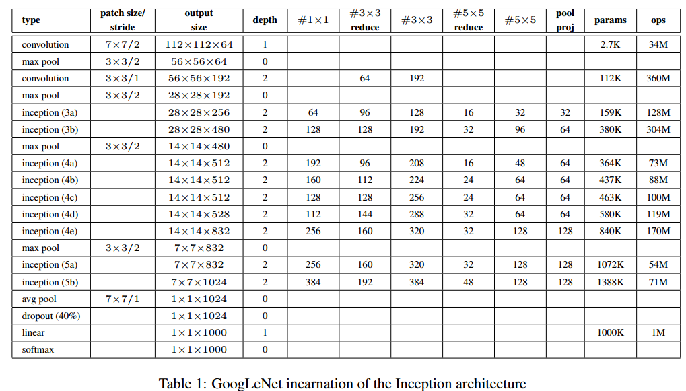

# 动机
改善网络性能最直接的办法就是增大网络的size——深度和宽度，深度指网络的层数，宽度指每一层的单元的个数，但是简单地增大网络的size会产生两个问题：

* 会增加网络的参数数量，使得模型容易过拟合

* 带来较大的计算开销，即使均匀的增加网络每层filter的数量，总的运算量也会以平方的规模增加（当前层的filter的数量会影响下一层的参数的数量，当前层filter数量加倍，下一层的参数量也会翻倍）

解决这两个问题的根本方法是**从完全连接的架构过渡到稀疏的连接架构，甚至在卷积内部也是如此**

## 稀疏连接
稀疏连接有两种方法：

* 空间（spatial）上的稀疏连接，也就是 CNN 。其只对输入图像的局部进行卷积，而不是对整个图像进行卷积，同时参数共享降低了总参数的数目并减少了计算量

* 在特征（feature）维度上的稀疏连接进行处理，也就是在通道的维度上进行处理。

上面第二点，就是 Inception 结构的灵感来源。Arora在**Provable bounds for learning
some deep representations**中提到，如果数据集的概率分布能够被一个大的稀疏神经网络进行表示，那么最优网络拓扑可以通过如下方式逐层构建：分析上一层的激活输出的统计特性，并将具有高度相关性输出的 filter 进行聚类 (cluster)，来获得一个稀疏的表示

尽管严格的数学证明需要较强的条件，但是结合 Hebbian principle，实际上，即使在弱条件下，该论断也是成立的

## Hebbian Principe
Hebbian Principe 是一个很通俗的现象。

先摇铃铛，之后给一只狗喂食，久而久之，狗听到铃铛就会口水连连。这时狗的听到铃铛的神经元与控制流口水的神经元之间的连接被加强了。

Hebbian principle的精确表达就是，**如果两个神经元常常同时产生动作电位，或者说同时激活（fire），这两个神经元之间的连接就会变强，反之则变弱**（neurons that fire together, wire together）

对应到神经网络的filter，就是将**强化具有相似特征的filter之间的关联**。具体做法就是，**用更少的filter来提取相关的特征，但是通过多个尺度的 filter进行不相关的特征组合。实际上就是预先把相关性强的特征汇聚，就能起到加速收敛的作用**

# Inception模块

## 1×1卷积的作用
* 在相同尺寸的感受野中叠加更多的卷积，能提取到更丰富的特征

* 缩减通道数，从而减少计算量

上图中(a)与(b)的参数对比

## 多个尺寸上进行卷积再聚合
* 在多个尺度上同时进行卷积，能提取到不同尺度的特征。特征更为丰富也意味着最后分类判断时更加准确

* 利用稀疏矩阵分解成密集矩阵计算的原理来加快收敛速度。举个例子下图左侧是个稀疏矩阵（很多元素都为0，不均匀分布在矩阵中），和一个2x2的矩阵进行卷积，需要对稀疏矩阵中的每一个元素进行计算；如果像右图那样把稀疏矩阵分解成2个子密集矩阵，再和2x2矩阵进行卷积，稀疏矩阵中0较多的区域就可以不用计算，计算量就大大降低。这个原理应用到inception上就是要在特征维度上进行分解！传统的卷积层的输入数据只和一种尺度（比如3x3）的卷积核进行卷积，输出固定维度（比如256个特征）的数据，所有256个输出特征基本上是均匀分布在3x3尺度范围上，这可以理解成输出了一个稀疏分布的特征集；而inception模块在多个尺度上提取特征（比如1x1，3x3，5x5），输出的256个特征就不再是均匀分布，而是相关性强的特征聚集在一起（比如1x1的的96个特征聚集在一起，3x3的96个特征聚集在一起，5x5的64个特征聚集在一起），这可以理解成多个密集分布的子特征集。这样的特征集中因为**相关性较强的特征聚集在了一起，不相关的非关键特征就被弱化**，同样是输出256个特征，inception方法输出的特征“冗余”的信息较少。用这样的“纯”的特征集层层传递最后作为反向计算的输入，自然收敛的速度更快

## 池化
因为池化在当前主流的CNN模型上已经证明十分重要，因此Inception模块中单独有一个分支进行池化操作，应该具有附加的益处

# GoogLeNet网络结构

## 网络参数表

## 模型示意图

## 模型实现细节
* 输入尺寸为224×224，使用RGB格式的图像，并分别对每个通道减去各通道的均值
* 网络设计始终考虑在移动设备上的实用性，最终网络深度为**22层**(只计算包含参数的层)。总的网络层数大约为**100层**
* 将最后的全连接层，替换为均值池化层(论文Network in Network中提出的)，将会使得top-1精度改善0.6%。因为全连接层占据大部分计算量，且容易过拟合。但**即使移除全连接层，dropout层也必不可少**
* 网络额外增加了2个辅助的softmax，输出的loss乘以个系数再加到总的loss上，作者认为可以防止梯度消失问题（事实上在较低的层级上这样处理基本没作用，作者在后来的inception v3论文中做了澄清）

# 参考
[Inception-v1 论文详解](https://zhuanlan.zhihu.com/p/69345065)

[深入理解GoogLeNet结构（原创）](https://zhuanlan.zhihu.com/p/32702031)
