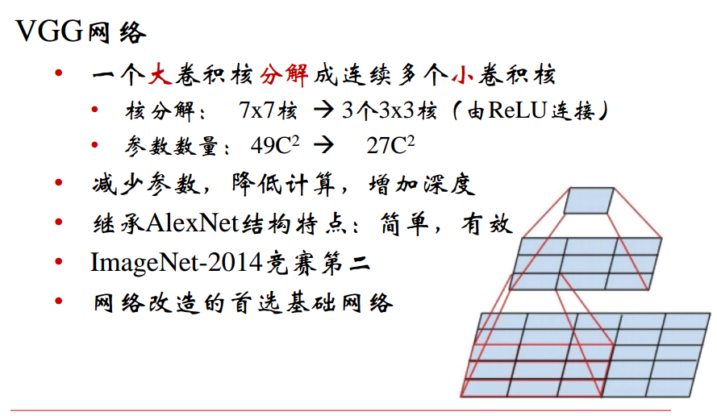
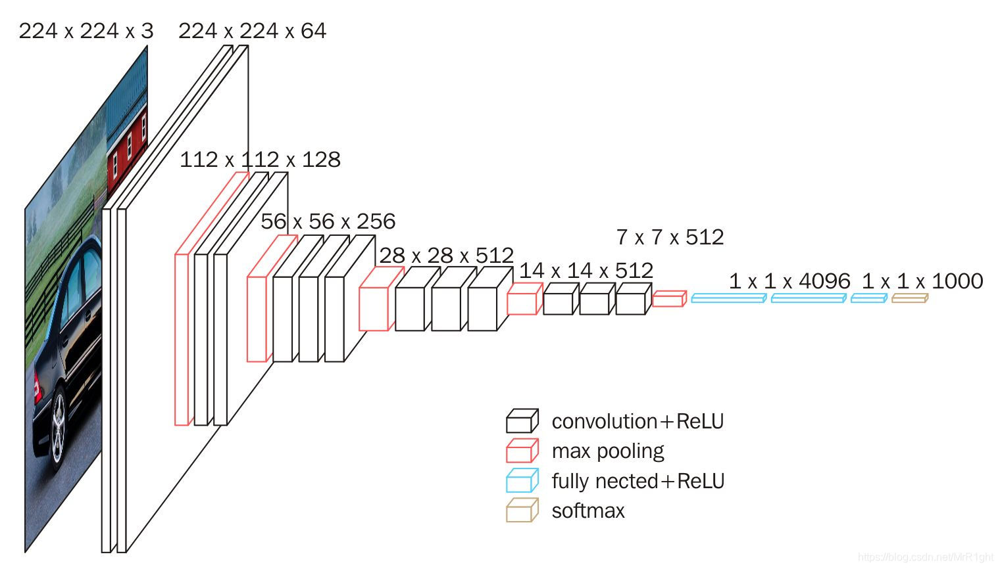
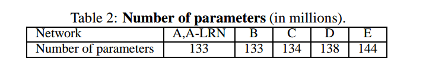
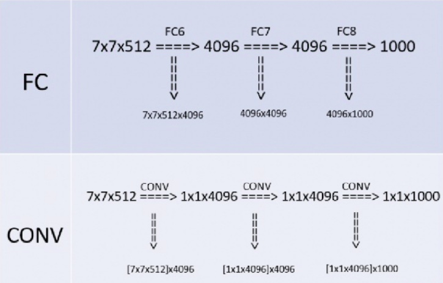
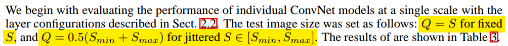
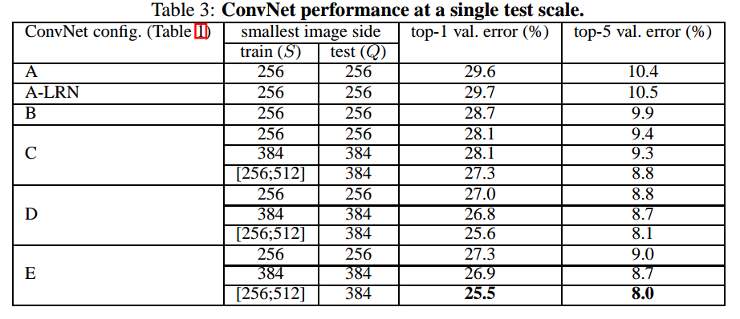
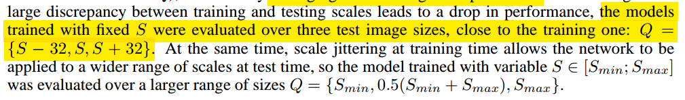
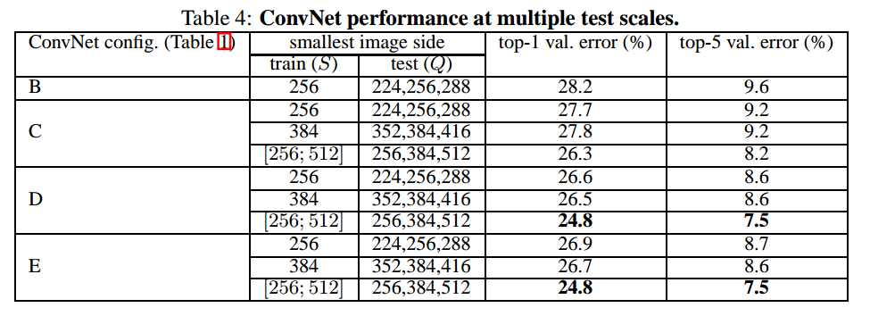
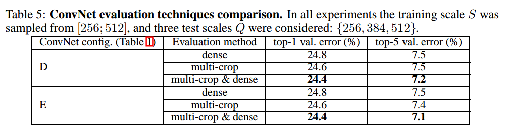

# 要点

* 网络深：相比AlexNet(5个卷积层+3个FC层)， 网络深度增加了(16个卷积层+3个FC层）
* 卷积核小：用大量的3x3卷积核替换了AlexNet中其他size的卷积核
* 效果好：在ILSVRC2014分类中排名第二(第一是GoogLeNet)，定位比赛排名第一

# 网络架构
## 各层配置
与AlexNet和LeNet一样，VGG网络由卷积层模块后接全连接层模块构成

 

## 各层尺寸

## VGG vs AlexNet

## 内存与参数量

###  VGG-16:

### 参数数量

# 重点分析
## 3x3 卷积核代替更大尺寸的卷积核的作用

以3个3x3 卷积核代替7x7卷积核为例，在具备相同感受野的情况下，前者

* 参数数量少：(3x3xCx3 = 27 C) < (7x7xC = 49C)

* 非线性能力更强：每个3x3的卷积核后都接有一个ReLU

## 1x1卷积核的作用

* 用在VGG中是为了加深网络的深度并减少参数的数量（与3x3 卷积核相比）

## 网络设计规则

* 卷积层不改变feature map的尺寸(stride=1,padding=1)，只有池化层才会对feature map进行下采样(window size=2x2, stride=2)
* 特征图尺寸相同的网络层，这些层产生特征图的通道数也相同。VGG中每个block的特征图尺寸相同，所以每个block中每层的卷积核个数相同
* 如果特征图尺寸减半，则增加一倍的通道数来保证每层的复杂度相同。也就是**每下采样一次则卷积核的个数增加一倍**

## 关于training

首先VGG的网络是输入为224×224的RGB图像（虽然现在pytorch中在FC层之前使用了AdaptiveAvgpooling使得大于224的图像也可以输入进去，而且能得到正确的结果，但是我们这里暂时不考虑这个）。先定义S为一幅**保持长宽比(isotropically-rescaled)的图像的最小边的值**。

作者设计了两种方案来处理训练集(**先rescale再crop为224×224**)

1）采取固定大小的S，将图像resize成最短边为S, 并保持图像的长宽比和原始图像一致。然后从resize后的图像里**裁剪出224×224大小**的图像。作者使用了两个固定的256， 384。为了加速当S=384的训练过程时，将网络的权重初始化为S=256的训练完成的权重

2）第二种方法使用一个多尺度训练，即S的值是在一个范围[Smin, Smax] 里面随机变换的。作者使用Smin=256, Smax=512。因为一般来说我们想要识别的物体不一定会在图像的中间，而且图像中的物体的大小也不都是相同的。所以这样多尺度的处理是合理的，这种方法属于图像增强的一种，即通过尺度抖动（scale jittering）来增强图像

## 关于testing

### Dense testing

首先作者也定义了一个Q，这个Q和上面的S含义相同。（注意S是在训练集中用到，Q是训练集中用的，而且Q和S不必相等）。然后将resize后的图像输入训练好的网络（**没进行crop**），这个网络将training过程的网络的**FC层全部替换为卷积层**，其中将第一个FC层替换为7×7×4096的卷积层，其余两个FC层替换为1×1×1000的卷积层，这时的网络是一个全卷积网络(FCN)，因为testing过程中输入网络的图像大小不是224×224，因此网络输出的结果为class score map，将这些score map进行average pooling后进行softmax计算

### Multi-Crop testing

对图片进行Multi-crop，裁剪大小为224×224，并水平翻转1张图，缩放至3种尺寸，然后每种尺寸裁剪出50张图片（5×5×2），**3个尺度共150张**求softmax输出的均值

### 上述两种方法的分析
Szegedy et al.2014年在GoogLeNet中得出multi-crops相对于FCN效果要好，multi-crops相当于对于dense evaluatio的补充，原因在于，两者在边界的处理方式不同：
* dense相当于padding补充0值
* multi-crop相当于padding补充了相邻的像素值，并且增大了感受野

# 实验结果

## SINGLE SCALE EVALUATION

### Setup

### Results

* A-LRN的效果几乎和A相差无几，说明LRN几乎没有作用
* B的效果比A好说明网络的深度对性能的提升是有助的
* B中的每个卷积层的感受野和5×5的卷积核的感受野一样大，尝试将B中的5个卷积层都用一个5×5的卷积核替代，实验发现替代后的Top-1误差高了7%，说明 **a deep net with small filters outperforms a shallow net with larger filters**，进一步说明网络深度对网络性能的提升是有助的
* D的效果比C好说明用卷积核去capture spatial context是重要的
* 当网络深度达到19层时，性能接近饱和，对更大的数据集，更深的网络可能是有助的

## MULTI-SCALE EVALUATION
### Setup

### Results

* 相同配置的multi-scale evaluation与single-scale evaluation相比performance更好，说明
在test的时候的数据增强会提高performance

## MULTI-CROP EVALUATION
### Results

* multi-crop应该是指三层全连接按dense的方法换成卷积层之后去做multi-crop
* 从结果来看multi-crop > multi-crop > dense
* multi-crop的结果稍好于dense的方法，但是存在重复计算带来的效率的问题

# 参考

[精读深度学习论文(1) VGG](https://zhuanlan.zhihu.com/p/33275704)

[图像处理必读论文之二：VGG网络](https://zhuanlan.zhihu.com/p/156842032)

[CNN系列学习之VGG16](https://blog.csdn.net/MrR1ght/article/details/97964975)
