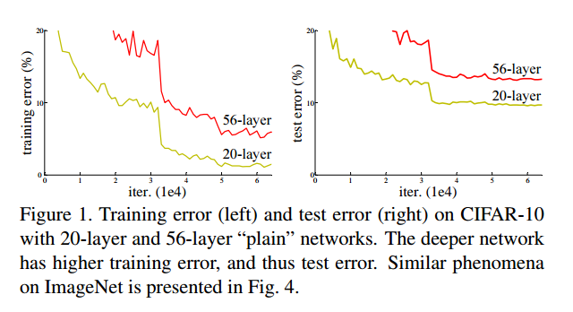
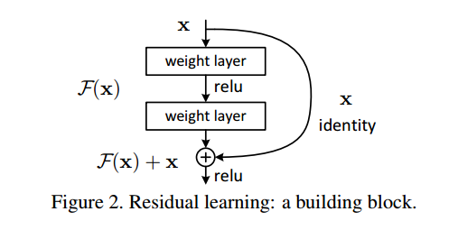
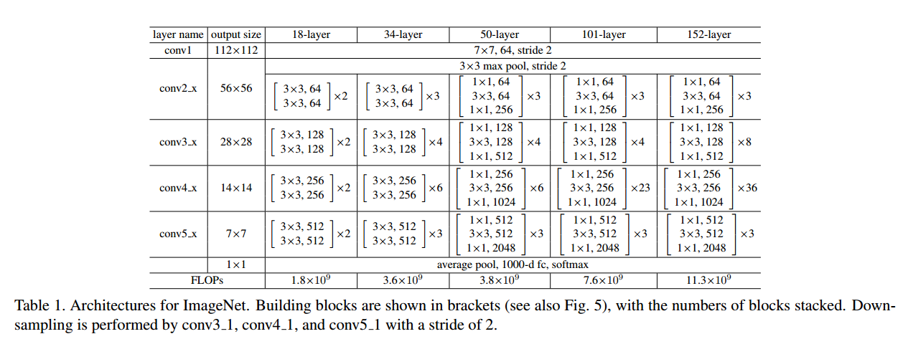
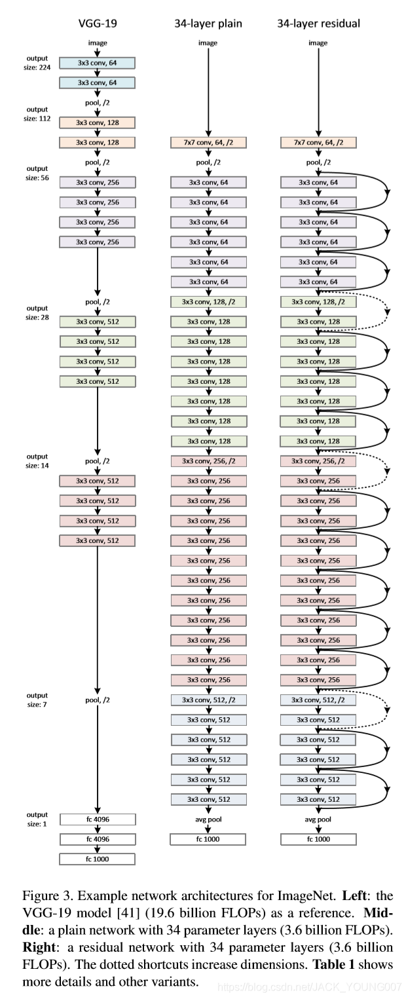
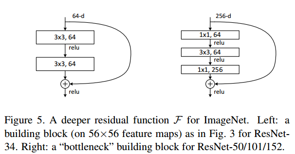
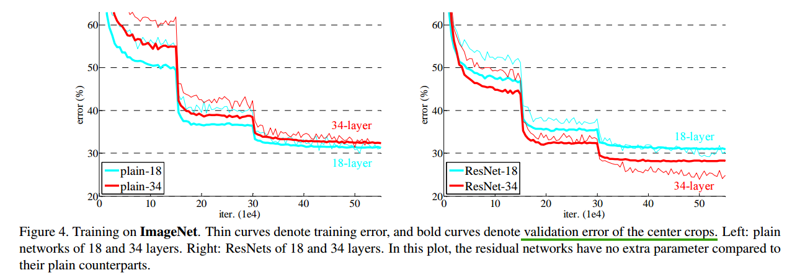
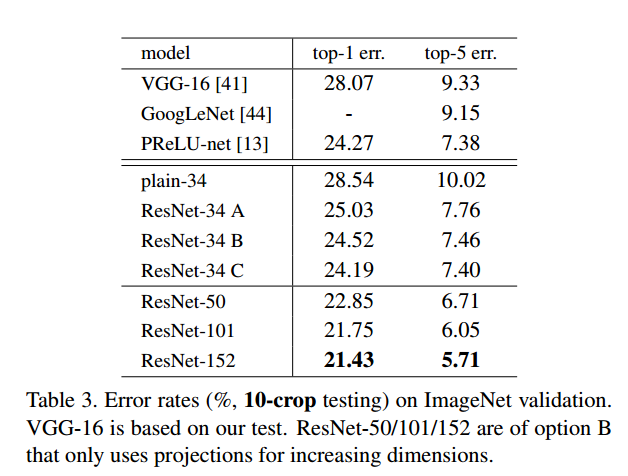

# 现有问题
## 梯度消失或梯度爆炸
假设每一层的误差梯度都是一个小于1的数，深度越深，梯度越小。反之，如果假设误差梯度都是一个大于1的数，深度越深，梯度越大

解决方法：数据标准化，权重初始化以及BN来解决

## 退化问题
在不断增加神经网络的深度时，会出现一个Degradation（退化）的问题，即准确率会先上升然后达到饱和，再持续增加深度则会导致准确率下降。这并不是过拟合的问题，因为不光在测试集上误差增大，训练集本身误差也会增大。如图示：

解决方法：论文中提出的残差结构

# 亮点
* 超深的网络结构（突破1000层）
* 提出residual模块
* 使用BN加速训练(丢弃Dropout)

# 动机
假设现有一个比较浅的网络（Shallow Net）已达到了饱和的准确率，这时在它后面再加上几个恒等映射层（Identify mapping，即 y = x，输出等于输入），这样就增加了网络的深度，并且起码误差不会增加，即更深的网络不会带来训练集上的误差上升。这里提到的 “使用恒等映射直接将前一层输出传到后面” 的思想，便是深度残差网络的灵感来源

ResNet 引入残差网络结构 （residual network），通过这种残差网络结构，可以把网络层弄得很深（目前可达1000+层），并且最终的分类效果也非常好，残差网络的基本结构如图示：（该图带有跳跃结构）

假定某段神经网络的输入是x，期望输出是H(x)，即H(x)是期望的复杂潜在映射。如果要学习这样的模型，则训练难度会比较大；回想前面的假设，如果已经学习到较饱和的准确率（或者当发现某一层的误差变大时），那么接下来的学习目标就转变为恒等映射的学习，也就是使输入 x 近似于输出 H(x)，以保持在后面的层次中不会造成精度下降。

在上面的残差网络结构图中，通过 “shortcut connections” 的方式，直接把输入 x 传到输出作为初始结果，输出结果为 H(x) = F(x) + x，当 F(x) = 0 时，那么 H(x) = x， 也就是上面提到的恒等映射。于是 ResNet 相当于将学习目标改变了，不再是学习一个完整的输出，而是目标值 H(x) 和 x 的差值，也就是所谓的残差 F(x) = H(x) - x，因此，**后面的训练目标就是将残差结果逼近于0，使得随着网络层数加深，准确率不下降**

# 网络结构

作者共提出了5种不同深度的ResNet，分别为18-layer,34-layer,50-layer,101-layer, 152-layer

 

ResNet的网络架构的设计遵循了和VGG相同的思想：

* 特征图尺寸相同的网络层，这些层产生特征图的通道数也相同

* 如果特征图尺寸减半，则增加一倍的通道数来保证每层的复杂度相同。也就是**每下采样一次则卷积核的个数增加一倍**

下图为VGG-19, plain network(ResNet-34无shortcut connections)以及ResNet-34的网络结构对比

在上图中可以看出shortcut connections"具有实线和虚线之分，其区别主要在于：
* 实线的connection部分，表示通道数相同，feature map 也是相同的，所以采用计算方式为 H(x) = F(x) + x

* 虚线的connection部分，表示通道数和feature map的大小不同，如上图的第一个绿色矩形和第三个绿色矩形，分别是64通道和128通道，通道不同，采用的计算方式 H(x) = F(x) + Wx，其中 W 是卷积操作，用来调整维度和通道数。

# 残差结构

上图的的左边的结构为ResNet-18以及ResNet-34所使用的残差块，出于运算量的原因，在ResNet-50, ResNet-101以及ResNet-152中都使用的是右边的结构，其中1×1卷积核用于通道数的调整。

左图是两个3×3的卷积，参数数目为3×3×256×256×2=1179648（上图是64通道，为保证计算具有对比性，调整为与右图一致的通道数256）。右图第一个卷积核把256维通道数降为64维，然后在最后面通过 1×1 卷积恢复，整体上用的参数数目：1×1×256×64+3×3×64×64+1×1×64×256=69632，右图的参数数量比左图减少了约17倍。因此，右图主要目的就是为了减少参数量，从而减少计算量

# 实验结果
## 解决退化现象

左图是不同深度的plain network的训练误差以及验证误差，右图是不同深度的ResNet的训练误差以及验证误差，可以看出作者提出的这种残差结构确实可以解决网络深度增加时产生的退化现象

## 效果好

# 参考
* https://www.bilibili.com/video/BV1T7411T7wa
* https://blog.csdn.net/qq_34823656/article/details/96010327
* https://blog.csdn.net/JACK_YOUNG007/article/details/89341254
* https://zhuanlan.zhihu.com/p/35019701
