# 设计理念
DenseNet与ResNet主要有以下几个区别：

* 提出了一个更激进的密集连接机制：即互相连接所有的层，具体来说就是每个层都会接受其前面所有层作为其额外的输入

* DenseNet是直接concat来自不同层的特征图，这可以实现特征重用，提升效率

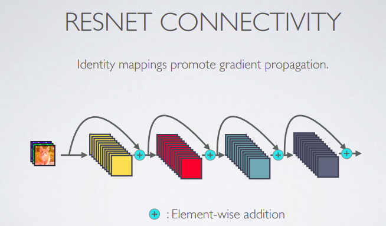

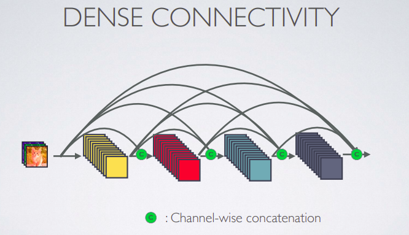

* DenseNet的每个Block中的卷积核的个数更少

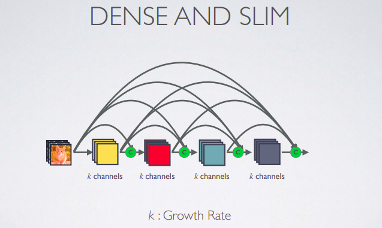

# 网络架构
DenseNet的网络结构主要由**Dense Block**和**Transition**组成，其中Dense Block完成各个feature map之间的稠密连接，Transition用于连接两个相邻的DenseBlock，并且降低特征图的大小

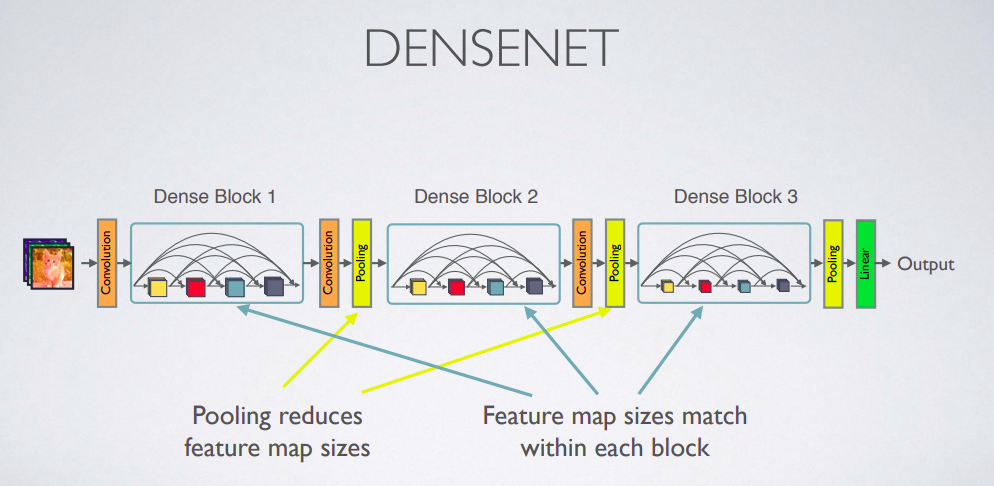

## Dense Block

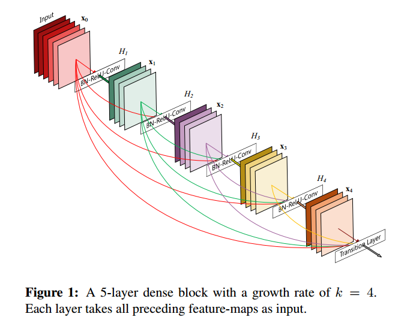

* 对于一个输入通道数为k0的input，经过一个增长率为k，层数为l的Dense Block，输出的通道数为k0+k(l-1)，，随着层数增加，尽管k设定得较小，Dense Block的输入会非常多，不过这是由于特征重用所造成的，每个层仅有 [公式] 个特征是自己独有的。此外，整个block中的connection数为l(l+1)/2

* Dense Block中各个layer进行concatenation之后，再通过一个Composite function

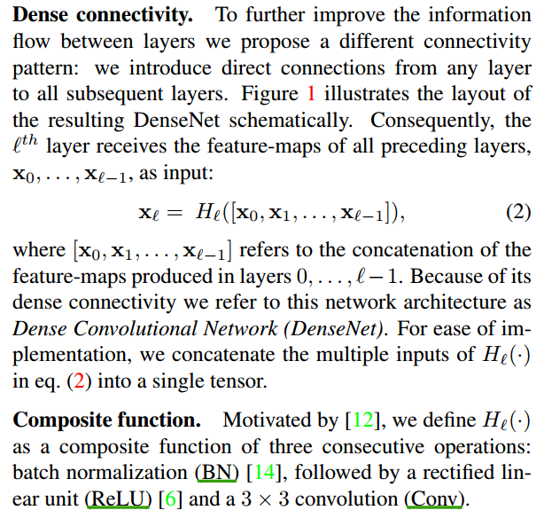

## Transition
Transition层由一个BN层，一个1×1的卷积层以及一个2×2的**平均池化层**组成

## DenseNet architectures for ImageNet

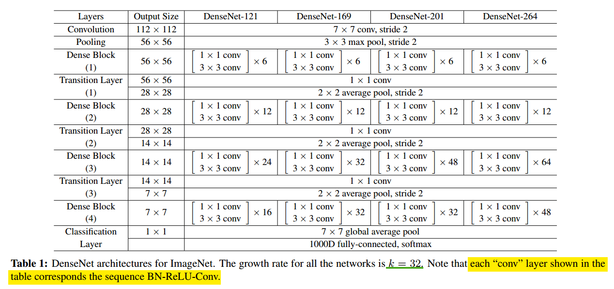

## DenseNet-B
为减少计算量，在Dense Block引入BottleNeck层

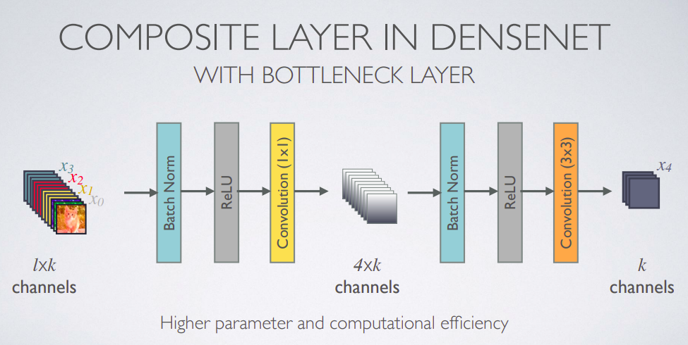

## DenseNet-C

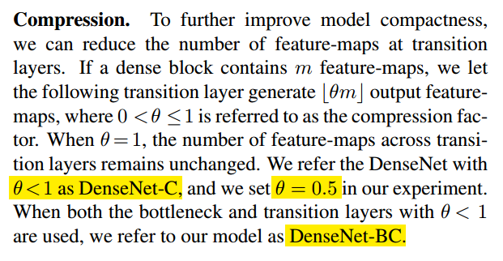

# 实验结果
作者在ImageNet, CIFAR以及SVHN等多个数据集上将DenseNet与当时的SOTA进行了对比，尤其将DenseNet与ResNet及其变体进行了对比

## ImageNet

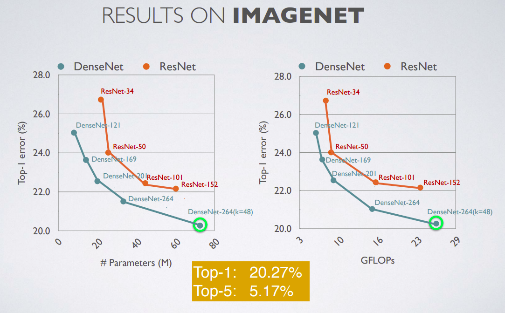

## CIFAR

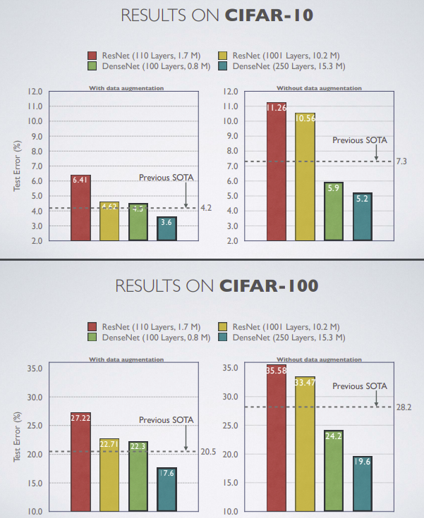

# 讨论
综合来看，DenseNet的优势主要体现在以下几个方面：

* 由于密集连接方式，DenseNet提升了梯度的反向传播，使得网络更容易训练。由于每层可以直达最后的误差信号，实现了隐式的"deep supervision"

* 参数更小且计算更高效，这有点违反直觉，由于DenseNet是通过concat特征来实现短路连接，实现了特征重用，并且采用较小的growth rate，每个层所独有的特征图是比较小的

* 由于特征复用，最后的分类器使用了低级特征

# 参考
* [DenseNet CVPR slide](http://www.gaohuang.net/papers/DenseNet-CVPR-Slides.pdf)
* [DenseNet：比ResNet更优的CNN模型](https://zhuanlan.zhihu.com/p/37189203)
