# 概述
这篇文章是17年的提出的一个轻量级神经网络MobileNet-V1。一句话概括：MobileNetV1就是把标准卷积层换成深度可分离卷积，这种方法能用更少的参数、更少的运算，达到跟跟普通卷差不多的结果。

# 亮点

## 深度可分离卷积(Depthwise separable convolution)

深度可分离卷积就是将普通卷积拆分成为一个**深度卷积(Depthwise conv)**和一个**逐点卷积(Pointwise conv)**

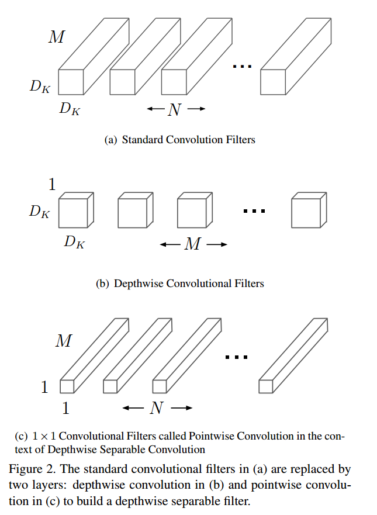

### 深度卷积(Depthwise conv)
深度卷积将卷积核拆为单通道的形式，在**不改变输入特征图像的深度**的情况下，对每一通道进行卷积操作，这样就得到了和输入特征图通道数一致的输出特征图

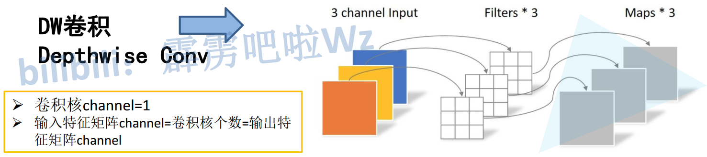

### 逐点卷积(Pointwise conv)
逐点卷积就是1×1卷积。主要作用就是对特征图进行升维和降维

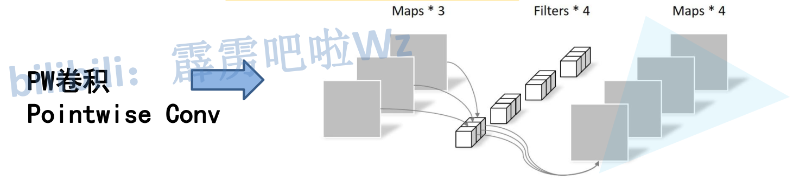

### 参数对比

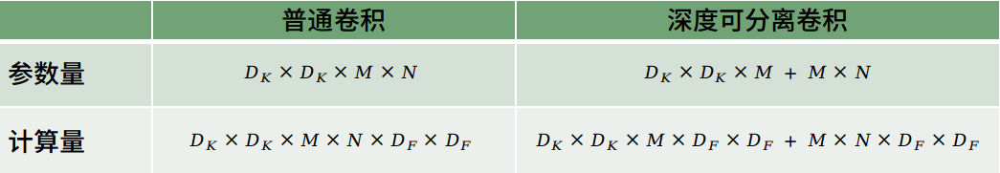

计算量减少

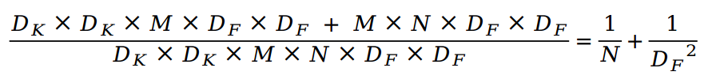

参数量减少

网络中所使用的是3×3的卷积核，也就是会下降到原来的**九分之一到八分之一**

## 通过超参数调整模型大小
MobileNet中提出两个超参数：**α和ρ**

### Width Multiplier
**α**称为Width Multiplier，用来调整每个block中卷积核的通道数，可以根据不同场景进一步减小模型的计算量以及参数量（以**α^2的比例减小**）

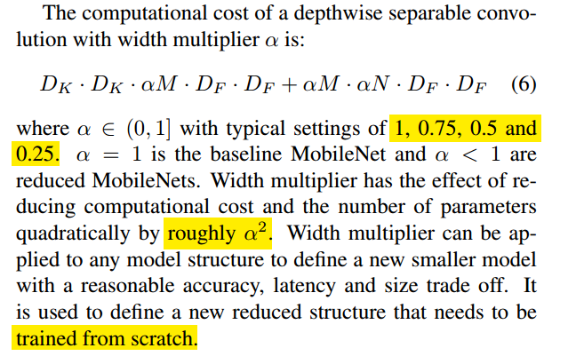

### Resolution Multiplier
**ρ**称为Resolution Multiplier，用来调整输入图像的大小，下图为联合考虑**α和ρ**时深度可分离卷积的计算量，**ρ**和**α**一样都以大致**ρ^2**的比例减小模型的计算量

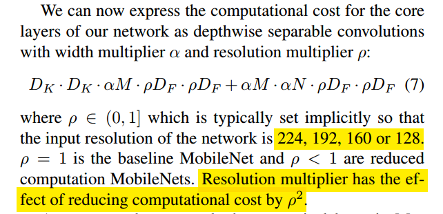

# 网络结构
## depthwise separable block
除了最后一个全连接层以外的所有层之后都连接着BN层以及ReLU

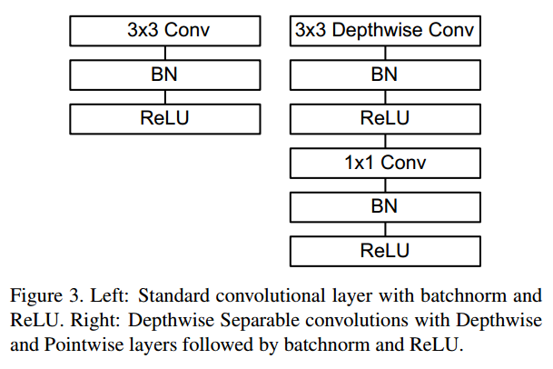

## 架构

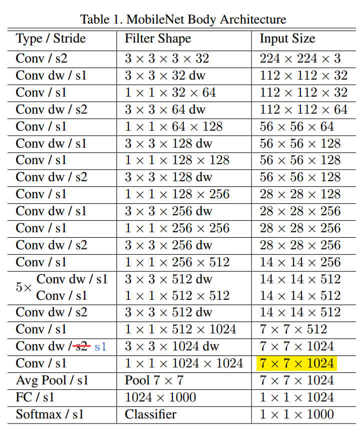

## 参数及运算量占比
整个网络中1×1的卷积占了接近95%的运算时间以及75%的参数量，而其余的参数量基本都在全连接层，其中Depthwise conv所占的运算时间以及参数量都很小

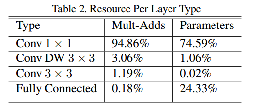

# 实验结果
## Depthwise Separable vs Full Convolution MobileNet
用depthwise separable block代替一般的conv，在精度仅下降1%左右的情况下大大减小的模型的运算量和参数量

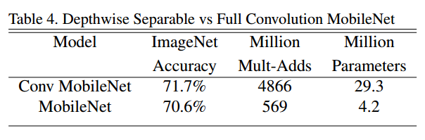

## 两个超参数的影响
* Accuracy随着α的减小而平缓下降，直到α=0.25的时候下降比较剧烈
* Accuracy随着ρ的减小而平缓下降

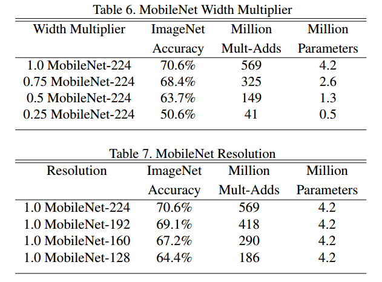

## 与其他classic network对比
实验没有与ResNet进行对比，在ImageNet上，ResNet-152可以达到78.57%的Top-1 accucracy

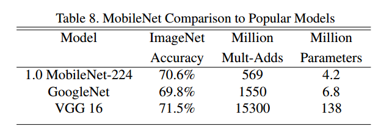

参数以及计算量对比

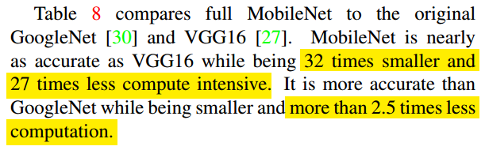

# 参考
* [轻量级神经网络“巡礼”（二）—— MobileNet，从V1到V3](https://zhuanlan.zhihu.com/p/70703846)

* [理解分组卷积和深度可分离卷积如何降低参数量](https://zhuanlan.zhihu.com/p/65377955)
