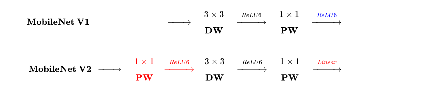
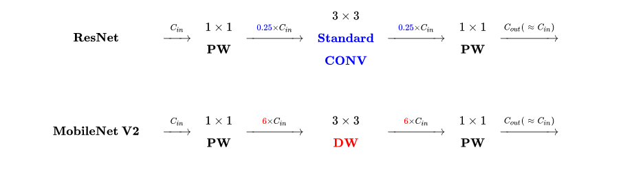
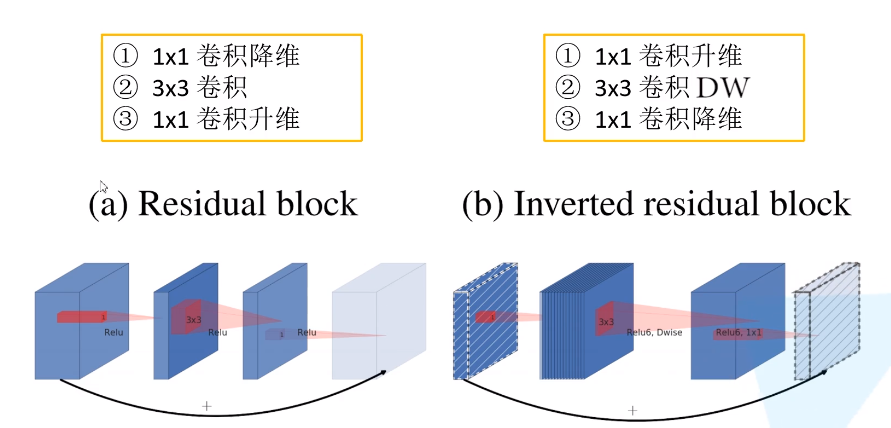
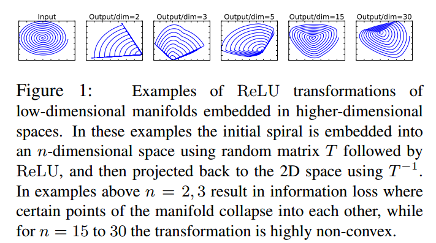
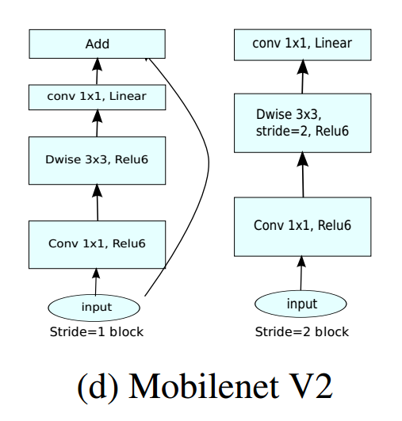
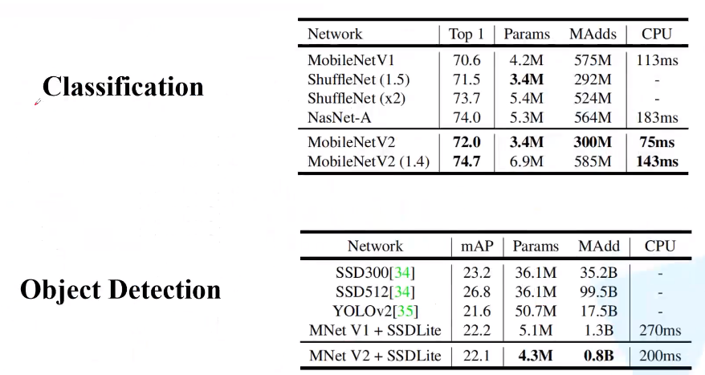

# 创新点

* Inverted residual
* Linear Bottleneck

## Inverted residual
文中提出的Inverted residuals结构其实是Residual block与Depthwise Separable block的一种结合

### MobileNet V1 vs MobileNet V2

* Inverted residuals block 在 DW 卷积之前**新加了一个 PW 卷积**。这么做的原因，是因为 DW 卷积由于本身的计算特性决定它自己没有改变通道数的能力，上一层给它多少通道，它就只能输出多少通道。所以如果上一层给的通道数本身很少的话，DW 也只能在低维空间提特征，因此效果不够好。现在 V2 为了改善这个问题，给每个 DW 之前都配备了一个 PW，专门用来升维，这样不管输入通道数是多是少，经过第一个 PW 升维之后，DW 都是在相对的更高维提取特征。

* V2 去掉了第二个 PW 的激活函数。论文作者称其为 Linear Bottleneck。这么做的原因，是因为作者认为激活函数在高维空间能够有效的增加非线性，而在低维空间时则会破坏特征，不如线性的效果好。由于第二个 PW 的主要功能就是降维，因此按照上面的理论，降维之后就不宜再使用 ReLU6 了。

* ReLU6的作用：ReLU6就是普通的ReLU但是限制最大输出值为6（对输出值做clip），这是为了在移动端设备float16的低精度的时候，也能有很好的数值分辨率，如果对ReLU的激活范围不加限制，输出范围为0到正无穷，如果激活值非常大，分布在一个很大的范围内，则低精度的float16无法很好地精确描述如此大范围的数值，带来精度损失

### ResNet vs MobileNet V2

Residual block vs  Inverted residual block

* ResNet 使用 标准卷积 提特征，MobileNet 始终使用 DW卷积 提特征。
* ResNet 先降维 (0.25倍)、卷积、再升维，而 MobileNet V2 则是 先升维 (6倍)、卷积、再降维。直观的形象上来看，ResNet 的微结构是沙漏形，而 MobileNet V2 则是纺锤形，刚好相反。因此论文作者将 MobileNet V2 的结构称为 Inverted Residual Block。这么做也是因为使用DW卷积而作的适配，**希望特征提取能够在高维进行**

## Linear Bottleneck
这一部分主要通过分析**manifold of interest**来说明ReLU会对低维特征信息造成大量的损失。

下边这部分解释出自于[轻量级网络--MobileNetV2论文解读](https://blog.csdn.net/u011974639/article/details/79199588)

长期以来我们认为：在神经网络中manifold of interest可以嵌入到低维子空间，通俗点说，当我们查看卷积层中所有单个d通道像素时，这些值中存在多种编码信息，而manifold of interest就位于其中。我们可以通过变换，进一步嵌入到下一个低维子空间中(例如通过1 × 1 1×11×1卷积变换维数，转换manifold of interest所在空间维度)

Input是一张2维数据，其中manifold of interest是蓝色的螺纹线；本例使用矩阵T将数据投影到n维空间中，后接ReLU，再使用T^(-1)将其投影回2D平面，可以看到设置n=2,3时信息丢失严重，中心点坍塌掉了。当n=15,30之间，恢复的信息明显多了

存在的问题： 我们想要manifold of interest存在于低维空间中，即想要提升效果，维度是要低一点。但是维度如果低的话，激活变换ReLU函数可能会滤除很多有用信息，而ReLU对于没有滤除的部分，即非零的部分的作用是一个线性分类器

既然在低维空间中使用ReLU做激活变换会丢失很多信息，论文针对这个问题使用linear bottleneck(即不使用ReLU激活，做了线性变换)的来代替原本的非线性激活变换。到此，优化网络架构的思路也出来了：通过在卷积模块中后插入linear bottleneck来捕获兴趣流行。 实验证明，使用linear bottleneck可以防止非线性破坏太多信息

# 网络结构
## Convolutional block

值得注意的是，只有当block的输入和输出的feature map的**size和channel数一致**时才有short connection分支

## Architecture

# 实验结果

# 参考
* [MobileNet网络详解](https://www.bilibili.com/video/BV1yE411p7L7)
* [MobileNet V2 论文初读](https://zhuanlan.zhihu.com/p/33075914)
* [轻量级网络--MobileNetV2论文解读](https://blog.csdn.net/u011974639/article/details/79199588)
* [Relu6 作用](https://blog.csdn.net/u011808673/article/details/95216694)
* [Mobilenetv2 source code](https://github.com/tensorflow/models/tree/master/research/slim/nets/mobilenet)
